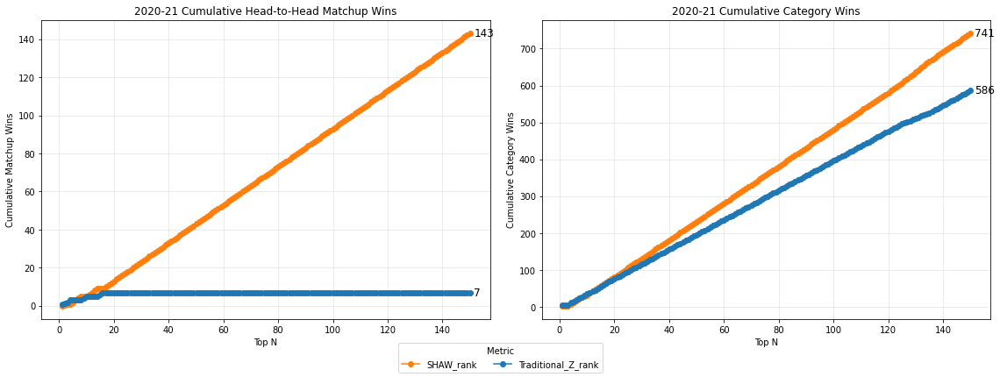

# Fantasy-Basketball-Player-Ranker 2.0
Improvements on existing fantasy basketball ranking algorithms (e.g., ESPN, BasketballMonster) using PCA and SHAW (Structured Hierarchical Adjusted Weights) for category leagues. 

Fantasy Basketball category leagues typically rank players by standardizing their statistics across nine (or more) categories and summing the resulting values. This approach implicitly assumes that each category contributes equally to player value and that statistical categories accumulate independently. Prior attempts to improve on this framework exist, but few have shown empirically defensible gains (e.g., Rosenof).

I propose a simple and intuitive alternative based on the covariation of statistical categories. Fantasy categories do not accumulate independently; they co-vary within players, and this covariation is structured by three player types: guards, bigs, and, to a lesser extent, wings. Because conventional nine-category leagues emphasize categories that disproportionately reward guards, a clear implication follows: weighting the dominant cluster of covarying categories yields player rankings that actually win head-to-head matchups. I demonstrate this method and evaluate it using a straightforward, if static, matchup-based approach, showing substantial improvements over traditional Z-score systems.

## Methods

### 1. Data and Preprocessing
I used per-game player statistics from the last five NBA seasons (2020-21 through 2024-25), including the standard nine categories used in Fantasy Basketball category leagues:

- Points (PTS)  
- Three-pointers made (FG3M)  
- Rebounds (REB)  
- Assists (AST)  
- Steals (STL)  
- Blocks (BLK)  
- Field-goal percentage (FG%)  
- Free-throw percentage (FT%)  
- Turnovers (TOV)  

Percentage categories were transformed into *impact* metrics (e.g., FT Impact, FG Impact), which adjust percentage effects by shooting volume. All categories were standardized using z-scores to place them on a common scale.

Players with insufficient games played (< 15% of the season) were removed. Players that averaged less than 15 minutes per game were also removed. 

---

### 2. Traditional Z-Score Ranking
The standard method used by most fantasy analysts—and implemented by major sites like Yahoo, ESPN, and Basketball Monster—ranks players by:

1. Converting each scoring category into a z-score  
2. Summing z-scores across categories  
3. Sorting players by the summed value  

I reproduced this method to serve as a baseline comparison.

ESPN and Yahoo appear to adjust those rankings by forecasting (perhaps given team dynamics like injuries which can change a players' usage), but their formulas for doing so are left opaque. In any case, their rankings do not fair well against the straightforward Z-score model when comparing players' per-game stats. 

Basketball Monster also deviates from straightforward Z score ranking in subtle and opaque ways that tend to beat traditional Z score rankings in head-to-head matchups using per-game stats. 

---

### 3. Category Covariation Analysis
To examine whether fantasy categories truly accumulate independently, I computed the **category–category correlation matrix** using the nine standardized categories.  

Next, I applied **Principal Components Analysis (PCA)** to the correlation matrix to identify latent dimensions structuring NBA production.

PCA revealed:

- **PC1 (~58% variance):** a guard-centric axis (AST, FG3M, STL, PTS, FT Impact)  
- **PC2 (~33% variance):** a big-centric axis (REB, BLK, FG Impact)  
- **PC3 (~3–4% variance):** a minor defensive axis  

These results indicate that fantasy categories cluster into two dominant groups aligned with player archetypes—**guards** and **bigs**, with wings occupying the overlap.

Results from PCA analysis can be confirmed using K-Means Cluster Analysis. 

---

### 4. Covariation-Informed Weighting (“SHAW Weights”)
Given the PCA and clustering results, I constructed a simple, interpretable weighting scheme for the nine statistical categories:

- Increase weights for categories loading heavily on the dominant PC1 (guard axis):  
  **PTS, FG3M, STL**
- Decrease weights for big-centric categories loading on PC2:  
  **REB, BLK**
- Reduce the turnover penalty to reflect its covariation with high-usage guard play  
- Leave FT Impact and FG Impact unmodified

This yielded the following weight vector:

| Category     | Weight |
|--------------|--------|
| PTS          | 1.15   |
| FG3M         | 1.15   |
| REB          | 0.55   |
| AST          | 1.00   |
| STL          | 1.35   |
| BLK          | 0.65   |
| FT Impact    | 1.00   |
| FG Impact    | 1.00   |
| TOV          | 0.85   |

The specific weights here are not what is important for this write up. It is the direction of weights in relation to the two dominant clusters that really matters. 
The weights themselves could be optimized in several ways. Here, I simply scaled up or down each by a degree of 0.05 to acheive the highest matchup wins against traditional Z rankings in one year's data. 

### 6. Weighted Z-Score Calculation
For each player, the SHAW metric is computed as follows:

1. Z-scores were computed for all nine categories  
2. Each z-score was multiplied by the corresponding SHAW weight  
3. Weighted z-scores were passed through a **clipped-Z transform** (lower bound = −3.8) to reduce the influence of extreme negative outliers 
4. Weighted, clipped z-scores were summed  
5. Players were ranked by this composite score  

The resulting ranking is the **SHAW metric**, a covariation-aware extension of the traditional Z-score.

---

### 7. Evaluation via Simulated Matchups
To evaluate ranking quality, I used a static but robust matchup simulation:

- Select top-N players by each ranking system  
- Form teams using those players  
- Compare every metric-vs-metric and sum-vs-sum matchup  
- Count category wins and matchup wins across all “top-N” levels for 150 players (i.e., top 1 vs. top 1, top 2 vs. top 2, top 3 vs. top 3, ... top 150 vs. top 150). 

This purely empirical method compares how often a ranking system produces a hypothetical team that outperforms another in category matchups.

Across all top-N tiers and all seasons tested, the SHAW metric consistently dominated against traditional Z-scores and Basketball Monster. In the 2020-21 NBA season, for example, my player ranker beat Basketball Monster in 144 of 150 top-n matchups (where n = 1-150) and it beat the Traditional_Z score ranking 143/150. Further discussion is forthcoming on my porfolio page https://sammyshaw.github.io/2025/04/01/fantasy-bball-ranker.html

---

